# Tenodera

<p align="center">
  
</p>

A self-hosted Linux server administration panel with real-time monitoring,
terminal access, and multi-host management -- all from a single web interface.

```
Browser ──WS──> Gateway (:9090) ──SSH──> tenodera-bridge (remote host)
                                 ──spawn──> tenodera-bridge (localhost)
```

No daemon, no open ports, no API keys on managed hosts.
The gateway connects via SSH and spawns the bridge process on demand.


## Features

| Category | Capabilities |
|----------|-------------|
| **Dashboard** | CPU, RAM, swap, disk I/O, network I/O -- real-time streaming charts |
| **Terminal** | Full PTY shell in the browser (xterm.js) |
| **Services** | systemd unit management -- start / stop / restart / enable / disable |
| **Users & Groups** | User account CRUD, group management, lock/unlock, password policy |
| **Packages** | Installed packages, search, install, update, repository management (apt, dnf, pacman) |
| **Storage** | Block devices, mount points, partition usage, I/O charts |
| **Networking** | Interfaces, traffic, firewall (ufw/firewalld/nftables), bridges, VLANs, VPN |
| **Containers** | Docker / Podman -- containers, images, create, logs (user + root) |
| **Files** | Remote file browser with sudo fallback |
| **Logs** | journald viewer with unit/priority filters and timestamps |
| **Log Files** | Browse `/var/log` with keyword search, context lines, date/time range |
| **Kernel Dump** | kdump status, crash kernel config, crash dump browser |
| **Multi-host** | Manage multiple servers from one panel with SSH host key verification |

## Install

### Panel (gateway + UI + local bridge)

```bash
curl -sSfL https://raw.githubusercontent.com/ultherego/Tenodera/main/install-panel.sh -o /tmp/install-panel.sh
sudo bash /tmp/install-panel.sh
```

This downloads the source, installs all build dependencies (Rust, Node.js,
system libraries), compiles everything natively, installs binaries and
systemd services, and starts the panel on port 9090.

### Bridge (managed hosts)

On each remote host you want to manage:

```bash
curl -sSfL https://raw.githubusercontent.com/ultherego/Tenodera/main/install-bridge.sh -o /tmp/install-bridge.sh
sudo bash /tmp/install-bridge.sh
```

No daemon or service -- the gateway spawns the bridge over SSH when needed.

### Build from source

If you prefer to clone the repo:

```bash
git clone https://github.com/ultherego/Tenodera
cd Tenodera

# Panel (gateway host):
cd panel && sudo make all

# Bridge (managed hosts):
cd bridge && sudo make all
```

### Uninstall

```bash
# Panel (removes gateway, bridge, UI, config, services):
sudo bash install-panel.sh --uninstall

# Bridge only (on managed hosts):
sudo bash install-bridge.sh --uninstall
```

Or from source: `cd panel && sudo make uninstall` / `cd bridge && sudo make uninstall`.

## Configuration

After install, the gateway config is at:

```
/etc/tenodera/gateway.env
```

Edit and restart: `sudo systemctl restart tenodera-gateway`

### TLS (recommended)

The gateway **requires TLS by default**. Generate or provide a certificate:

```bash
# Self-signed (testing):
sudo mkdir -p /etc/tenodera/tls
openssl req -x509 -newkey rsa:4096 -nodes -days 365 \
  -keyout /etc/tenodera/tls/key.pem \
  -out /etc/tenodera/tls/cert.pem \
  -subj "/CN=$(hostname)"
```

Then set in `gateway.env`:

```
TENODERA_TLS_CERT=/etc/tenodera/tls/cert.pem
TENODERA_TLS_KEY=/etc/tenodera/tls/key.pem
```

### Plaintext HTTP (development only)

```
TENODERA_ALLOW_UNENCRYPTED=1
```

> **Warning:** Without TLS, passwords and session tokens are sent in cleartext.

### Environment Variables

| Variable | Default | Description |
|----------|---------|-------------|
| `TENODERA_BIND_ADDR` | `0.0.0.0` | Listen address |
| `TENODERA_BIND_PORT` | `9090` | Listen port |
| `TENODERA_BRIDGE_BIN` | `/usr/local/bin/tenodera-bridge` | Path to bridge binary |
| `TENODERA_UI_DIR` | `/usr/share/tenodera/ui` | Path to built UI assets |
| `TENODERA_TLS_CERT` | *(none)* | TLS certificate path (PEM) |
| `TENODERA_TLS_KEY` | *(none)* | TLS private key path (PEM) |
| `TENODERA_ALLOW_UNENCRYPTED` | `false` | Allow HTTP without TLS |
| `TENODERA_IDLE_TIMEOUT` | `900` | Session idle timeout (seconds) |
| `TENODERA_MAX_STARTUPS` | `20` | Max failed login attempts per IP (5-min window) |
| `RUST_LOG` | *(none)* | Log filter (e.g. `tenodera_gateway=debug`) |

## Usage

Log in with any PAM user that has sudo privileges on the gateway host.
The panel uses system credentials (local accounts or LDAP/SSSD).

To add remote hosts, navigate to the **Hosts** page in the UI. The panel
scans the SSH host key fingerprint and asks for confirmation before adding.
The logged-in user must be able to SSH into the remote host with password
authentication, and `tenodera-bridge` must be installed there.

```bash
# Service management
sudo systemctl status tenodera-gateway
sudo systemctl restart tenodera-gateway
journalctl -u tenodera-gateway -f
```

## Architecture

```
[ Browser ]
     |
     | WebSocket (channel-multiplexed JSON)
     v
[ Gateway ]   Axum HTTP/WS server, PAM auth, session management
     |
     |--- localhost: spawns tenodera-bridge directly
     |--- remote:    ssh user@host tenodera-bridge  (via sshpass)
     v
[ Bridge ]    stdin/stdout newline-delimited JSON, per-user process
     |
     |--- 21 handler modules (system, services, packages, users, terminal, ...)
```

- **Gateway** authenticates users via PAM, manages sessions, serves the
  React UI, and routes WebSocket channels to bridge processes.
- **Bridge** is a stateless binary that handles system operations via
  newline-delimited JSON over stdin/stdout.
- **Protocol** is a shared Rust crate defining the message types used by
  both gateway and bridge.

No agent daemon runs on managed hosts. No ports need to be opened.

## Security

Designed for **internal networks** (VPN) with **FreeIPA/SSSD** authentication.
Not intended for public internet exposure.

### Authentication & Sessions

- **PAM authentication** via isolated subprocess — supports local accounts,
  LDAP, SSSD, and FreeIPA. PAM crashes don't affect the gateway (process isolation).
- **Sudo privilege check** at login — only users with sudo access can log in.
- **Per-IP rate limiting** on login attempts (sliding window, configurable via
  `TENODERA_MAX_STARTUPS`). Periodic cleanup prevents memory growth.
- **Session idle timeout** (default 15 min) with **4-hour absolute lifetime**.
  UUID v4 session IDs (122-bit entropy).
- **Password zeroization** in memory (`Zeroizing<String>` on the gateway,
  cleared from React state after login).

### Transport & Network

- **TLS required by default** (rustls, TLS 1.2+). Plaintext requires explicit
  `TENODERA_ALLOW_UNENCRYPTED=1`.
- **HSTS** (`max-age=63072000; includeSubDomains`) when TLS is active.
- **SSH host key verification** — enrolled hosts use `StrictHostKeyChecking=yes`.
  New hosts go through UI-based key fingerprint confirmation before trust.
- **SSH password auth only** (`PubkeyAuthentication=no`) — consistent with
  FreeIPA password model, avoids conflicts with passphrase-protected keys.
- **Core dumps disabled** via `prctl(PR_SET_DUMPABLE, 0)`.
- **16 KiB request body limit** on all HTTP endpoints.

### Input Validation (Bridge)

- **Path traversal protection** — all file-system operations use `canonicalize()`
  before prefix checks (packages, containers, log files, kdump).
- **Container volume denylist** — canonicalized paths checked against
  `/etc`, `/usr`, `/var`, `/boot`, `/sys`, `/proc`, `/root`, `/home`.
- **Shell validation** against `/etc/shells`; terminal uses a hardcoded
  allowlist of 8 shells.
- **GECOS validation** — rejects `:`, newlines, null bytes.
- **Package/container/unit name validation** — strict character whitelists.
- **`--` argument terminators** on all `Command` invocations with user input.
- **No shell interpolation** — all commands use `Command::arg()`, never `sh -c`.
- **Minimum streaming interval** enforced (500ms floor).

### Frontend

- **CSRF Origin check** on all state-changing HTTP requests.
- **WebSocket Origin validation** (prevents CSWSH attacks).
- **Security headers**: CSP (adaptive to TLS mode), X-Frame-Options DENY,
  X-Content-Type-Options nosniff, Referrer-Policy, Permissions-Policy,
  Cache-Control no-store on API responses.
- **Encrypted superuser password** persistence (AES-GCM 256-bit via Web Crypto
  API). Falls back to no persistence on plain HTTP — password cleared on refresh.
- **30-second timeout** on all WebSocket requests.

### Audit & Hardening

- **Structured audit logging** to `/var/log/tenodera_audit.log` (mode 0600)
  with log injection prevention (control character escaping).
  Dual output: file + journald.
- **Hardened systemd service** (NoNewPrivileges, ProtectKernelTunables,
  ProtectControlGroups, RestrictSUIDSGID).

### Known Limitations

These are architectural trade-offs accepted for the VPN + FreeIPA deployment
model. They would need to be addressed before any public-internet exposure.

| Area | Description |
|------|-------------|
| **Per-host ACL** | All authenticated users can access all hosts in `hosts.json`. FreeIPA controls who can log in to the panel, but there is no per-host granularity. |
| **Session ID in WS URL** | Session ID is passed as a query parameter on WebSocket upgrade. Low risk behind VPN (no proxies logging URLs). |
| **Sudo password in memory** | The superuser password exists in React state during the session. Encrypted at rest (sessionStorage), but in-memory exposure is architecturally inherent for sudo operations. |
| **sshpass in /proc/environ** | SSH password is passed via `SSHPASS` env var (readable in `/proc/<pid>/environ` by root). This is an sshpass limitation — only root can read it, and the gateway runs as root. |
| **TOFU for new hosts** | Hosts without a stored key use `StrictHostKeyChecking=accept-new` on first connection. Mitigated by the enrollment UI that shows the key fingerprint for confirmation. |
| **Rate limit clear-on-success** | Successful login resets the per-IP failure counter. Requires valid FreeIPA credentials to exploit. |

## Project Structure

```
panel/                   Central server (gateway + UI)
  crates/gateway/        Axum HTTP/WS gateway, PAM auth, SSH transport
  ui/                    React 19 + TypeScript SPA (Vite 6)
  Makefile               Build & install

bridge/                  Standalone bridge binary (deployed to managed hosts)
  src/handlers/          21 handler modules
  Makefile               Build & install

protocol/                Shared message types (Rust library crate)
```

## Screenshots

<details>
<summary>Click to expand screenshots</summary>

### Login


### Dashboard
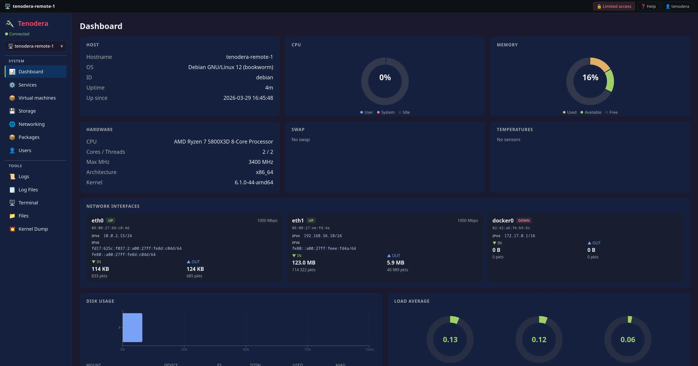

### Terminal


### Services
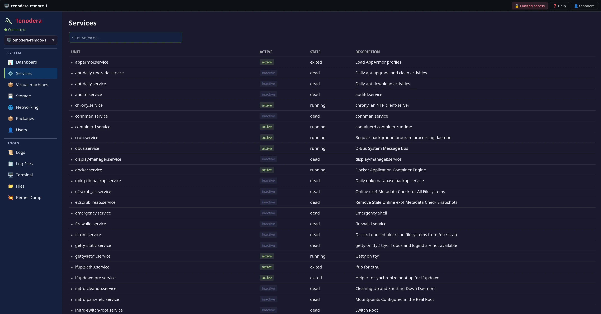

### Users
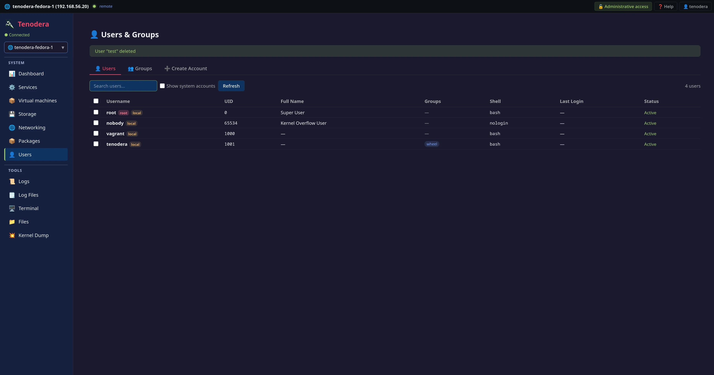

### User Groups
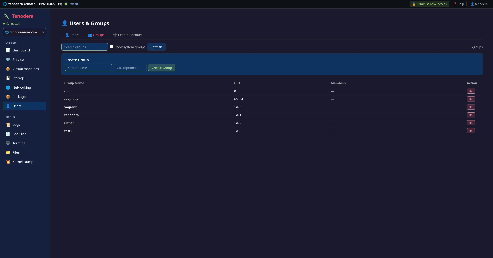

### Create User


### Packages
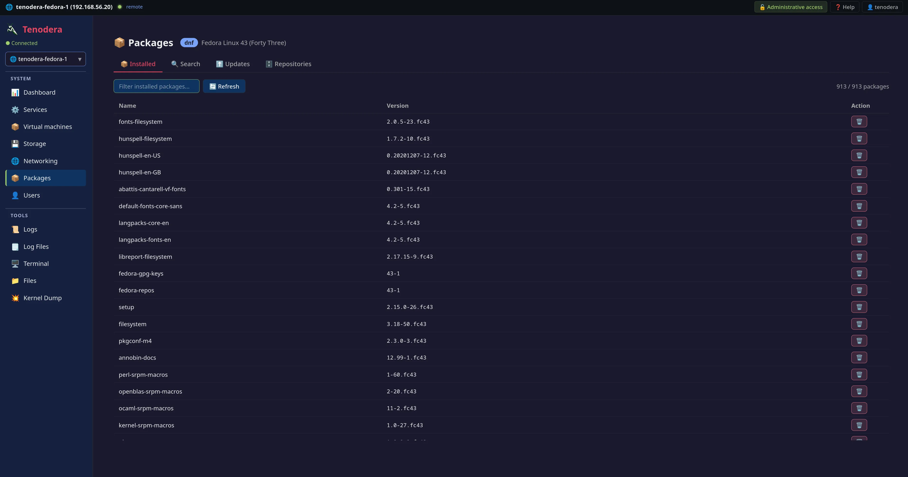

### Package Search


### Package Repositories
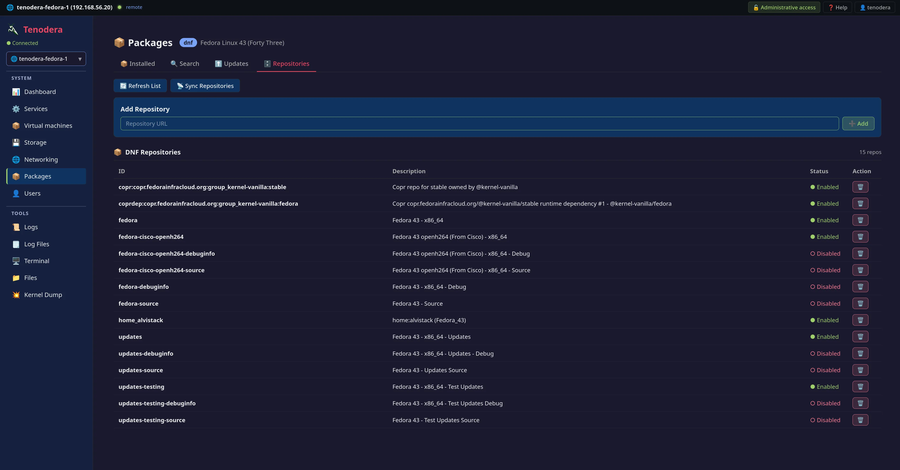

### Storage
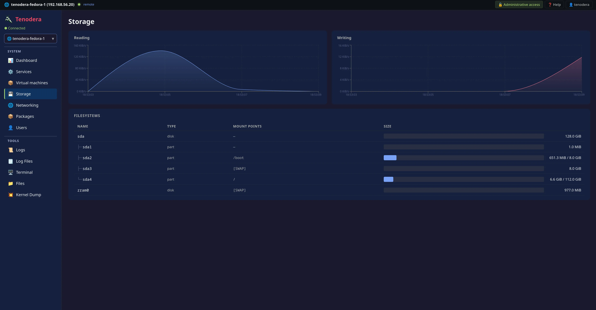

### Networking Overview
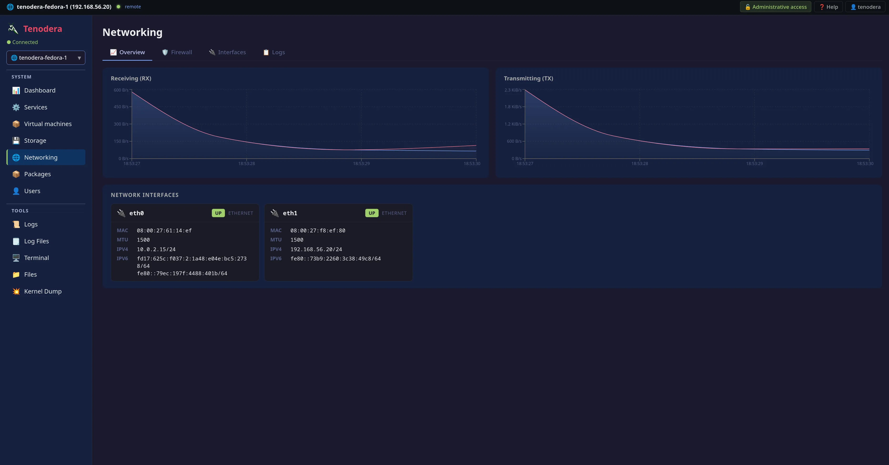

### Networking Interfaces


### Networking Firewall
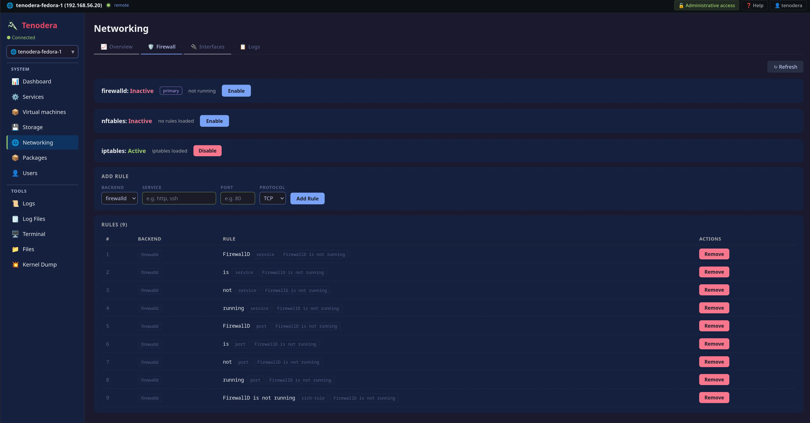

### Networking Logs


### Files
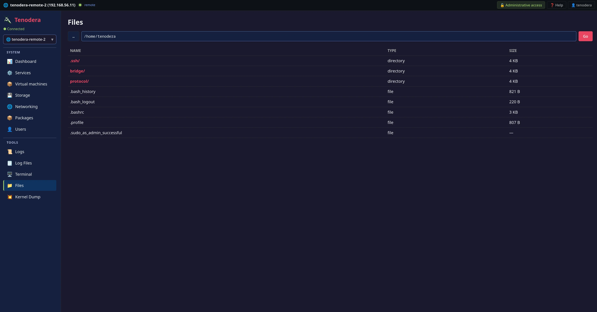

### Journal
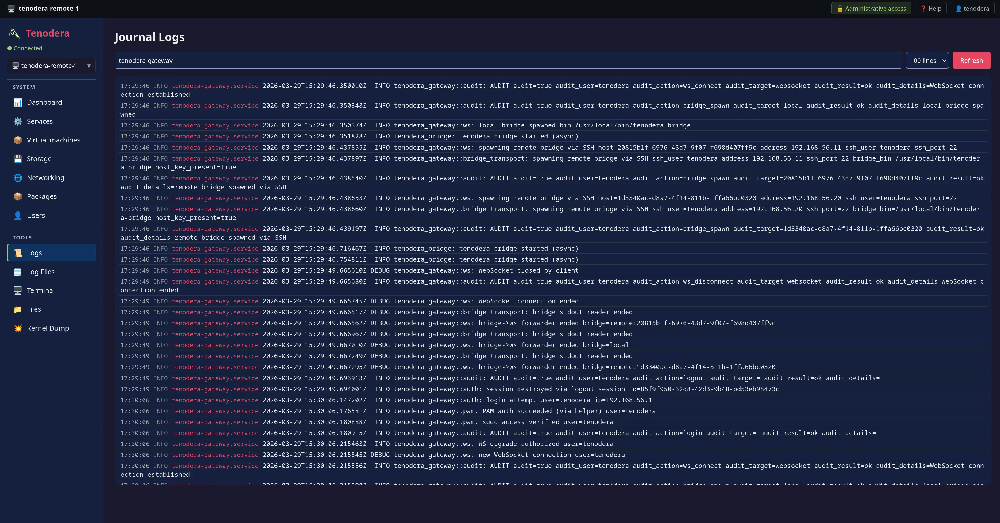

### Log Files
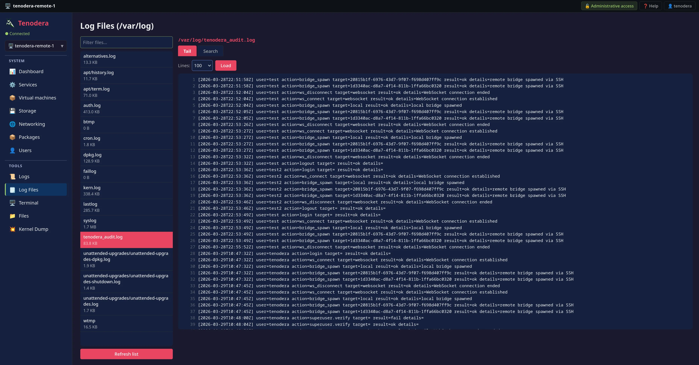

### Kernel Dump
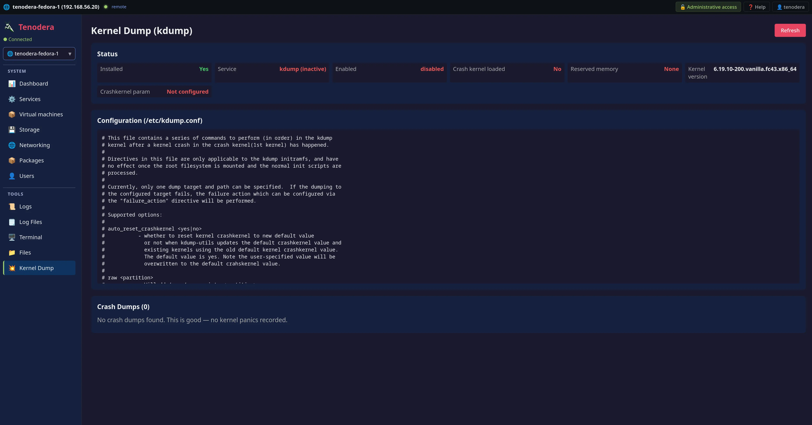

### Virtual Machines


</details>

## Development

```bash
# Gateway
cd panel && cargo clippy && cargo build

# Frontend (dev server with HMR, proxies /api to :9090)
cd panel/ui && npm ci && npm run dev

# Bridge
cd bridge && cargo clippy && cargo build
```

## License

[MIT](LICENSE)
